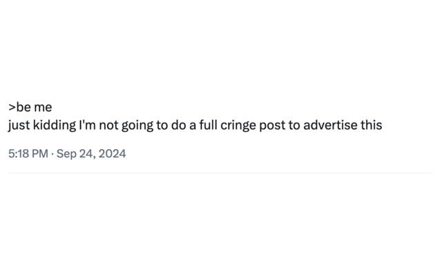
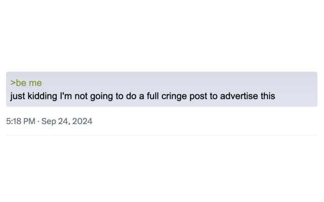
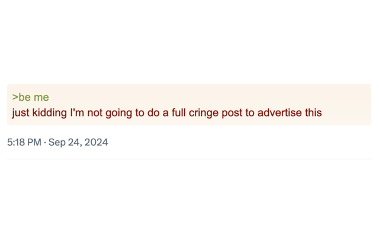

# Twitter Greentext Formatter

A Chrome extension that formats greentext-style tweets to look like 4chan
greentext, with customizable styling options.

## Features

- Automatically detects and formats greentext-style tweets on Twitter
- Two customizable styles for greentext background colors: Blue and Red
- Preserves original tweet content while making it look like the actual meme

## Installation

1. Download or clone this repository
2. Open Chrome and navigate to `chrome://extensions`
3. Enable "Developer mode" in the top right corner
4. Click "Load unpacked" and select the directory containing the extension files
5. Normal installation through the Chrome Web Store (free) should be available
   soon

## Usage

Once installed, the extension will automatically format any tweets containing
greentext-style content (lines starting with ">"). You can switch between Blue
and Red styles by clicking the extension icon in your browser toolbar.

### Before

### After (Blue Style)

### After (Red Style)

## Customization

You can easily customize the styles by modifying the `styles.css` file. The
extension uses two main classes:

- `.blue-style` for the blue background theme
- `.red-style` for the red background theme

## Contributing

Contributions are welcome! Please feel free to submit a Pull Request.

## Disclaimer

This extension is not affiliated with, endorsed by, or in any way officially
connected to X (formerly Twitter) or 4chan. It is an independent project created
for entertainment purposes only.
